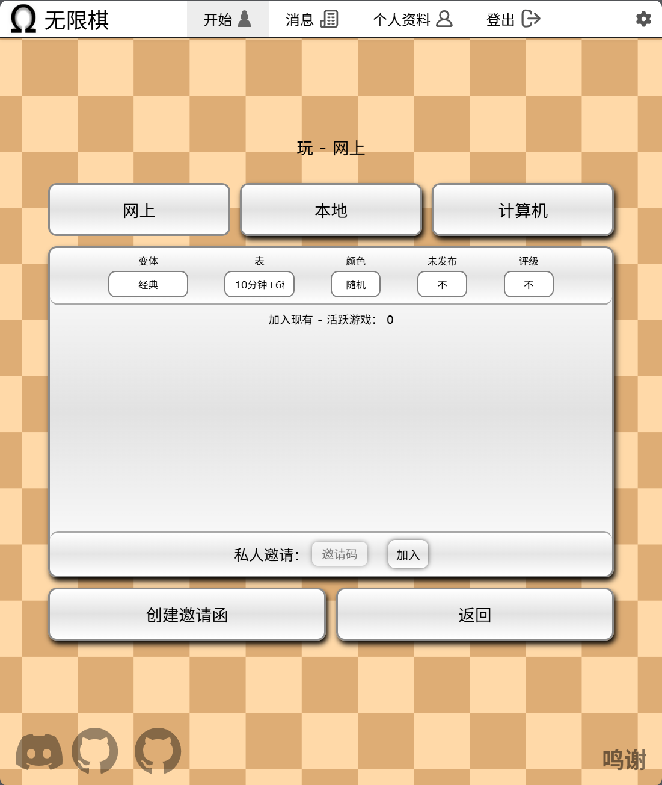
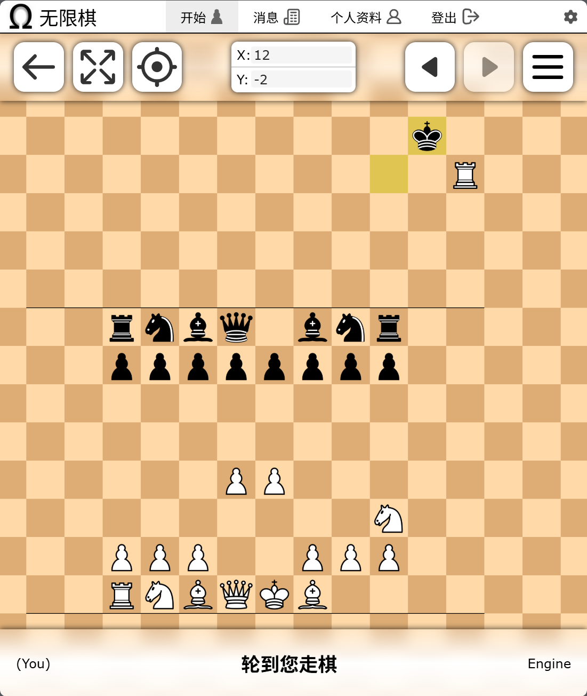

# Infinite Chess Web Server #
无限国际象棋网页服务器

[InfiniteChess.org](https://www.infinitechess.org) is a free and ad-less website for playing all kinds of chess variants on an infinite, boundless board.  
[InfiniteChess.org](https://www.infinitechess.org) 是一个免费且无广告的网站，用于在无限、无边界的棋盘上玩各种象棋变体。

What began as an indie project by [Naviary](https://www.youtube.com/@Naviary) in 2022 has been growing ever since. Inspired by the concepts of chess and infinity, he set out to craft a space where anyone can experience the thrills of freedom and exploration, reimagined within the familiar world of chess. No more limits, tear down the edges of the board - here we come!  
这个项目始于 2022 年 [Naviary](https://www.youtube.com/@Naviary) 的独立开发，自那以后不断发展。受象棋与“无限”概念的启发，他致力于打造一个任何人都能在这个熟悉的象棋世界中体验自由与探索乐趣的空间。不再有边界，撕掉棋盘的边缘——我们出发了！


## 部署说明

首先感谢原作者的开源。
- 原项目地址
  - 官网 https://www.infinitechess.org/
  - GitHub仓库 https://github.com/Infinite-Chess/infinitechess.org
- 我汉化和构建docker镜像的仓库
  - GitHub仓库 https://github.com/Firfr/infinitechess
  - Gitee仓库 https://gitee.com/firfe/infinitechess

具体汉化了那些内容，请参考[翻译说明](翻译说明.md)。


有需要帮忙部署这个项目的朋友,一杯奶茶,即可程远程帮你部署，需要可联系。  
微信号 `E-0_0-`  
闲鱼搜索用户 `明月人间`  
或者邮箱 `firfe163@163.com`  
如果这个项目有帮到你。欢迎start。

有其他的项目的汉化需求，欢迎提issue。或其他方式联系通知。

### 镜像

从阿里云或华为云镜像仓库拉取镜像，注意填写镜像标签，镜像仓库中没有`latest`标签

容器内部端口 1443 ,要使用`https`访问。
下面的例子中，把容器内部的`1443`映射到宿主机中的`3000`。

- AMD64镜像
  ```bash
  swr.cn-north-4.myhuaweicloud.com/firfe/infinitechess:2025.05.12
  ```
- ARM64镜像 这个镜像可能会有问题
  ```bash
  swr.cn-north-4.myhuaweicloud.com/firfe/infinitechess:2025.05.12-arm64
  ```

### docker run 命令部署

```bash
docker run -d \
--name infinitechess \
--network bridge \
--restart always \
--log-opt max-size=1m \
--log-opt max-file=3 \
-p 3000:1443 \
swr.cn-north-4.myhuaweicloud.com/firfe/infinitechess:2025.05.12
```

### compose 文件部署 👍推荐

```yaml
#version: '3.9'
services:
  infinitechess:
    container_name: infinitechess
    image: swr.cn-north-4.myhuaweicloud.com/firfe/infinitechess:2025.05.12
    network_mode: bridge
    restart: always
    logging:
      options:
        max-size: 1m
        max-file: '3'
    ports:
      - 3000:1443
```

### 数据及账号注册说明

- 要保留容器数据，需要在第一次运行容器后，把容器中的文件`/app/database.db`从容器中复制出来，在映射到容器中。
  - 进入设备终端，进入保留数据的目录。例如`/docker/infinitechess`
  - 执行下面命令，把数据库文件复制出来
    ```bash
    docker cp infinitechess:/app/database.db ./
    ```
- 账号注册
  - 在注册账号后，会提示验证邮箱
    ```
    请检查您的电子邮件以验证您的账户。未验证的账户将在 3 天后删除。
    ```
  - 打开容器的日志
  - 找到类似的内容
    ```
    Created new member: ceshi
    Email environment variables not specified. Not sending email. Click this link instead to verify:
    https://localhost:1443/verify/ceshi/fb3qlQOj
    Logged in member "ceshi".
    ```
    ```
    创建了新成员：ceshi
    未指定电子邮件环境变量。无法发送邮件。请点击以下链接进行验证：
    https://localhost:1443/verify/ceshi/fb3qlQOj
    已登录成员 "ceshi"。
    ```
    主要就是`https://localhost:1443/verify/ceshi/fb3qlQOj`
    - 把其中的`localhost:1443`部分替换成自己实际的IP和端口
    - 访问链接验证账号

## 修改说明

这里对除了汉化之外的代码修改的说明。  
这个项目是支持中文的，不过调试的时候发现了部分没有中文。  
增加修改部分具体见 [修改说明](./修改说明.md)。

`./README.md` 文件翻译，增加 `## 部署说明`、`## 修改说明`、`## 效果截图` 部分。

增加目录 `./图片` `./remote_files`(引用的远程文件)
新增文件 `./.dockerignore`、`./Dockerfile`、`./翻译说明.md`、`./修改说明.md`、`./本地调试命令记录.md` 

## 效果截图


|  |  |
|-|-|
|  |  |


## Contributing 贡献方式

This project is open source! If you have a feature idea you want to try implementing, or you have skills in html, css, javascript, or Node, we welcome contributions! To get started collaborating, please read the [Setup Guide](./docs/SETUP.md)!  
本项目是开源的！如果你有一个想要尝试实现的功能想法，或者你具备 HTML、CSS、JavaScript 或 Node.js 相关技能，我们欢迎你的贡献！要开始协作，请阅读 开发环境搭建指南[Setup Guide](./docs/SETUP.md)！

In case you want to help us with translating the website to other languages, please read the [Translation Guide](./docs/TRANSLATIONS.md).  
如果你想帮助我们将网站翻译成其他语言，请阅读 翻译指南[Translation Guide](./docs/TRANSLATIONS.md)。

We are still far off from our vision. We refuse to stop until many crucial features of this universe are built:  
我们离愿景还有很长的路要走。在实现这个宇宙中的许多关键功能之前，我们绝不会停下脚步：
- Truly infinite move distance  
  真正无限的移动距离
- Board Editor  
  棋盘编辑器
- Rating system, with leaderboards  
  积分系统与排行榜
- Premoving  
  预先移动（Premoving）
- Highlighting squares, drawing infinite lines  
  高亮格子、绘制无限长线
- Engine play  
  引擎对战
- Snapping to more easily threaten pieces  
  更容易威胁棋子的自动吸附功能
- Games with infinitely many pieces  
  包含无限多个棋子的对局
- 4 Player  
  四人模式
- Massive Multiplayer Online  
  大型多人在线模式
- and more! This list is not exhaustive.  
  还有更多！这份列表并不完整。

It has a license with a goal of keeping this game free forever! Check out [Copying](./docs/COPYING.md) for more details.  
我们采用了旨在永久保持游戏免费的许可证！详情请查看 授权协议[Copying](./docs/COPYING.md)。

## Navigation ##
导航

Check out the [Navigation Guide](./docs/NAVIGATING.md) for pointers on the structure of the project!  
如需了解项目的整体结构，请查阅 导航指南[Navigation Guide](./docs/NAVIGATING.md)！

[Join us on Discord](https://discord.gg/NFWFGZeNh5) for more info, or just to chat about the game!  
加入我们的 [Discord](https://discord.gg/NFWFGZeNh5) 服务器，获取更多信息或单纯地交流游戏内容！


